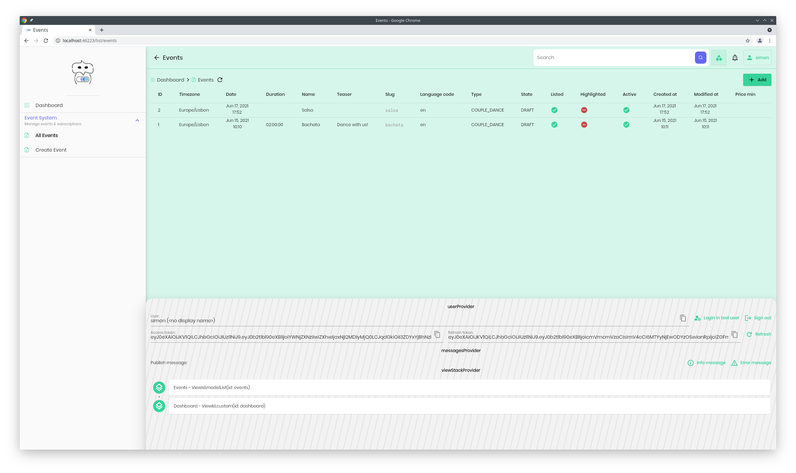
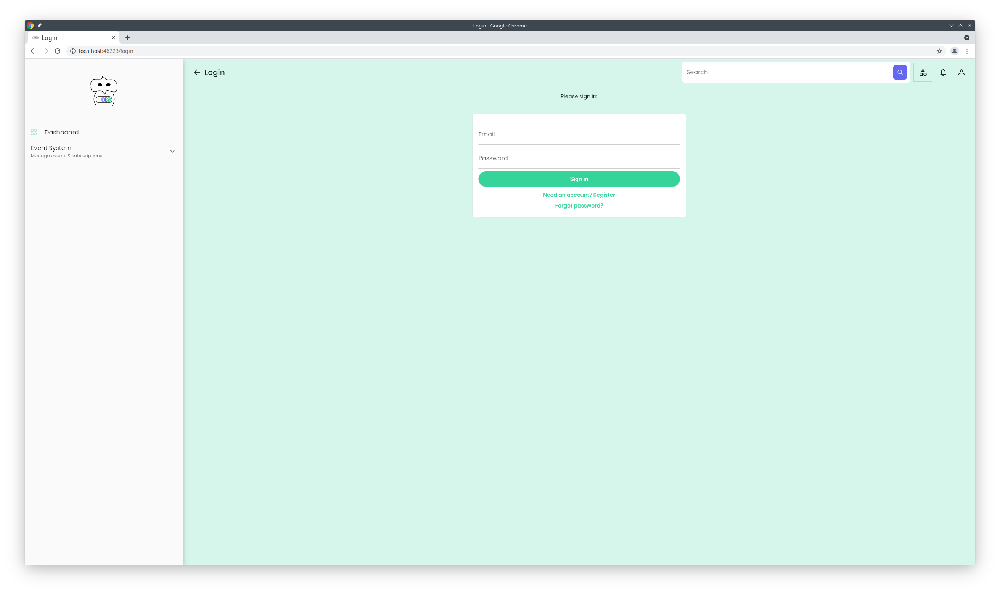

# flutter admin kit

Build a generative, customized admin for all platforms. Nice to use and nice to extend.

Learn more in the [introductory blog post & videos](http://localhost:9000/blog/flutter-admin-kit/) from the creator.

**Feature highlights:**

Declarative routing via global state:

Model list view dynamically generated from config files and an inspection API:

Authentication with OAuth based on auto-refreshed JWTs:

Debug panel for live inspection of global state

**A note on the backend:**

This example repository is integrated with a Django backend using [Django REST framework](https://www.django-rest-framework.org/). It can be easily adopted to any REST backend that provides some means of inspecting models via the API.

**Packages used:**

State management
- [freezed_annotation](https://pub.dev/packages/freezed_annotation)
- [flutter_riverpod](https://pub.dev/packages/flutter_riverpod)
- [shared_preferences](https://pub.dev/packages/shared_preferences)

Networking
- [http](https://pub.dev/packages/http)
- [http_interceptor](https://pub.dev/packages/http_interceptor)

Translation:
- [intl](https://pub.dev/packages/intl)
- [i18n_extension](https://pub.dev/packages/i18n_extension)

Auxiliary
- [universal_platform](https://pub.dev/packages/universal_platform)
- [yaml](https://pub.dev/packages/yaml)
- [path](https://pub.dev/packages/path)
- [url_strategy](https://pub.dev/packages/url_strategy)

Widgets
- [flutter_breadcrumb](https://pub.dev/packages/flutter_breadcrumb)
- [fl_chart](https://pub.dev/packages/fl_chart)
- [timeline_tile](https://pub.dev/packages/timeline_tile) (only used for the debug panel)

Asset handling:
- [flutter_svg](https://pub.dev/packages/flutter_svg)
- [google_fonts](https://pub.dev/packages/google_fonts)

**Fonts**

- [Poppin](https://fonts.google.com/specimen/Poppins)

**Credits**

- The basic dashbaord layout and responsive foundation was adopted from [Responsive Admin Panel or Dashboard - Flutter UI](https://github.com/abuanwar072/Flutter-Responsive-Admin-Panel-or-Dashboard)
